# Liner

[](https://github.com/ry-ops/Liner/releases/latest)

A "now playing" display for the [M5Stack PaperColor](https://docs.m5stack.com/en/core/PaperColor) — a 4" color e-paper dev board — driven by [Volumio](https://volumio.com/). It shows album art, title, and artist for whatever's currently playing, and refreshes automatically as tracks change.

The name is a nod to *liner notes* — the printed text and art that ship inside physical album packaging. That's essentially what this recreates on e-paper.

<p align="center">
  
</p>

## Features

- **Now-playing card**: full-width album art on top, title/artist/album text below, plus a bold platform/format/bitrate line for the audio nerds (e.g. `TIDAL 44.1kHz/16bit  ·  1411 kbps`)
- **Idle screen** when nothing is playing, cycling into a generative Spectra-6 screensaver after a long idle stretch
- **Event-driven refresh** — only redraws when the track actually changes, since a full e-paper refresh takes 15–30 seconds
- **Playback controls** — up/down buttons skip to the next/previous track
- **On-device Wi-Fi & settings portal** — no credentials baked into the firmware; a mobile-first web page (reachable both during first-time setup and, once connected, at `liner.local` on your normal LAN) handles network/Volumio config, OTA and screensaver toggles, and troubleshooting tips
- **OTA updates** — push new firmware over the network once it's on Wi-Fi, no more re-entering download mode for every change
- **Album art from any source** — local files, Tidal, and (untested so far) Spotify/other Volumio plugins, via a service-aware resolver

## Hardware

- **Board**: M5Stack PaperColor — ESP32-S3R8 (16MB flash, 8MB octal PSRAM), 400×600 4" E Ink Spectra 6 (6-color) e-paper panel
- **Buttons**: 3 user buttons (top = GPIO1, up = GPIO10, down = GPIO9) + 1 power button
- **Network**: connects to Wi-Fi directly; polls Volumio over your LAN

## How it works

### Firmware

Built with [PlatformIO](https://platformio.org/) on the Arduino framework, using [M5Unified](https://github.com/m5stack/M5Unified) / [M5GFX](https://github.com/m5stack/M5GFX). `M5.begin()` auto-detects the PaperColor board and its `Panel_ED2208` e-paper driver — the firmware just draws normal RGB888 graphics, and the panel driver quantizes everything down to the 6-color Spectra palette automatically on `display()`.

Because a full refresh takes 15–30 seconds, the main loop polls Volumio for state every few seconds but only triggers a screen redraw when the track (title/artist/album) actually changes — not on every poll.

### Wi-Fi setup and settings (no baked-in credentials)

Wi-Fi credentials and the Volumio host aren't compile-time config — they live in NVS (via `Preferences`), set through a small mobile-first web page. This is what lets one built binary (e.g. a release `.bin`, or something distributed through M5Burner) work for anyone, rather than requiring everyone to rebuild from source with their own network baked in.

The same page serves two purposes depending on context:

- **First-time setup** — opens automatically on first boot, if a saved network fails to connect, or any time you press the **top button** (which disconnects Wi-Fi first if already connected, so it doubles as an on-demand "switch networks" trigger). In this mode the device broadcasts its own access point (`Liner-Setup`); the screen shows that name and an IP to browse to.
- **Ongoing settings, once connected** — the same page is also reachable at `http://liner.local/` (or the device's LAN IP) during normal operation, no need to disconnect from your real network to reach it. From here you can change the network/Volumio host, or flip the **OTA updates** and **idle screensaver** toggles, without interrupting playback unless you actually change the network.

Saving with the network/password unchanged just updates settings in place; changing either triggers a reconnect (and, if it's mid-setup, exits the AP).

### OTA updates

Once connected, the device advertises itself at `liner.local` and accepts firmware pushed over the network:

```
pio run -t upload --upload-port liner.local
```

No password is set — this matches the setup portal's own trust model (convenience on a local network you already trust, not hardened against a hostile LAN). The very first flash still has to go over USB (see Setup below); every update after that can go over OTA instead.

### Talking to Volumio

Volumio exposes a REST API on the local network. Liner polls:

```
GET http://<volumio-host>:3000/api/v1/getState
```

which returns the current `status`, `title`, `artist`, `album`, `albumart`, and `service` (which plugin/source is playing — `mpd` for local files, `spop`/`volspotconnect2` for Spotify Connect, etc.). Playback controls use the same API's commands endpoint:

```
GET http://<volumio-host>:3000/api/v1/commands/?cmd=next
GET http://<volumio-host>:3000/api/v1/commands/?cmd=prev
```

Because Volumio abstracts every backend (local library, Tidal, Spotify, internet radio, ...) into this one interface, the firmware doesn't need to know anything about the specific streaming service — it just reads whatever Volumio reports.

### Album art: the progressive JPEG problem

The one place the source *does* matter is album art. Volumio's `albumart` field is either:

- a **relative path** (`/albumart?...`) — art Volumio serves itself, generally from local file tags — fetched directly, or
- an **absolute URL** to a streaming service's CDN (e.g. Tidal's `resources.tidal.com`)

Tidal (and many other CDNs) serve album art as **progressive JPEG**, which M5GFX's embedded JPEG decoder (TJpgDec) can't decode — it only supports baseline JPEG. Fetching worked fine; `drawJpg()` just silently failed on every image.

The fix: external art URLs are routed through [wsrv.nl](https://wsrv.nl), a free public image-resizing proxy, which re-encodes the image as baseline JPEG and resizes it to the display's art box in one request:

```
https://wsrv.nl/?url=<encoded-source-url>&w=400&h=400&fit=cover&output=jpg
```

This also shrinks the download significantly (a 105KB source image came back as 35KB), which helps given how slow a full-size fetch over Wi-Fi + HTTPS can be. Local Volumio-served art skips the proxy and is fetched directly, since it hasn't shown the same progressive-JPEG issue.

Album art resolution is dispatched by Volumio's `service` field (`resolveAlbumArtUrl()` in `src/main.cpp`), so each source has its own clear spot for future quirks. **Only the Tidal path has actually been exercised** — local file (`mpd`) and Spotify (`spop`/`volspotconnect2`) branches exist as stubs that currently fall through to the same generic logic, untested.

### Platform, format, and bitrate

Below the album name, a bold line shows whatever Volumio's `getState` populated in `service`, `trackType`, `samplerate`, `bitdepth`, and `bitrate` — e.g. `TIDAL 44.1kHz/16bit  ·  1411 kbps` (`buildMetaLine()` in `src/main.cpp`). It's built defensively since not every service fills in all of these fields, and only appears at all when there's something to show.

One quirk found via Tidal: Volumio's `trackType` field there reports the service name (`"Tidal"`) rather than an actual codec, which would otherwise duplicate the platform name shown right next to it (`Tidal · TIDAL 44.1kHz/16bit`). `buildMetaLine()` drops the redundant platform segment whenever `trackType` already matches it.

### Idle screensaver

After 5 minutes of nothing playing, the idle screen starts cycling through generative abstract patterns (scattered shapes, concentric rings, diagonal bands) built from the same Spectra 6 palette as the album art, changing every 10 minutes. Purely decorative — it's there so a stationary display isn't just static text for hours, without triggering more e-paper refreshes than that cadence can reasonably bear.

### Controls

| Button | Location | Action |
|---|---|---|
| Up | GPIO10 | Next track (`cmd=next`) |
| Down | GPIO9 | Previous track (`cmd=prev`) |
| Top | GPIO1 | Open Wi-Fi/Volumio setup — disconnects first if already connected |

Button polling is non-blocking (`M5.update()` runs every loop iteration; Volumio polling is time-gated separately) — an earlier version blocked on a 5-second `delay()` between polls, which meant a quick tap could start and end entirely between checks and never register.

## Setup

> **Prebuilt binary:** each [release](https://github.com/ry-ops/Liner/releases) includes a merged, single-file `.bin` (flash at offset `0x0`) alongside the source — no Wi-Fi/Volumio config baked in, since that's all handled by the on-device setup portal described above. Flash it and configure it like any other build.

1. Build:
   ```
   pio run
   ```

2. Flash. The PaperColor's factory firmware doesn't expose a USB serial console during normal boot, so you'll need to manually put it into download mode first: **hold the reset button** while it's connected over USB, then run:
   ```
   pio run -t upload --upload-port /dev/cu.usbmodemXXXX
   ```

3. **After flashing, press the power button once** to boot into the new firmware. In practice, esptool's software-triggered reset at the end of upload doesn't reliably boot this board into the app — a physical button press is needed. This sometimes takes a couple of tries.

4. On first boot, it'll have nothing saved and open the setup portal automatically — connect to `Liner-Setup` from a phone or laptop and follow the on-screen IP to configure your network and Volumio host.

From here on, firmware updates can go over OTA (`pio run -t upload --upload-port liner.local`) instead of repeating steps 2–3.

## Known limitations

- Only the Tidal album art path is verified; local/Spotify/other-service art handling is untested (see stubs in `resolveAlbumArtUrl()`).
- The setup portal and OTA updates are both unauthenticated — fine on a trusted home LAN, not hardened against a hostile network.
- Flashing and booting over USB both currently require manual button presses (see Setup) — software-triggered resets aren't reliable on this board/toolchain combination. OTA updates don't have this problem; they reboot on their own.
